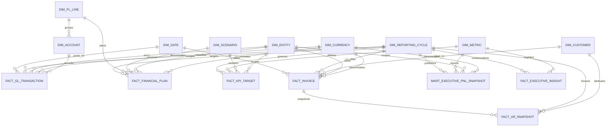
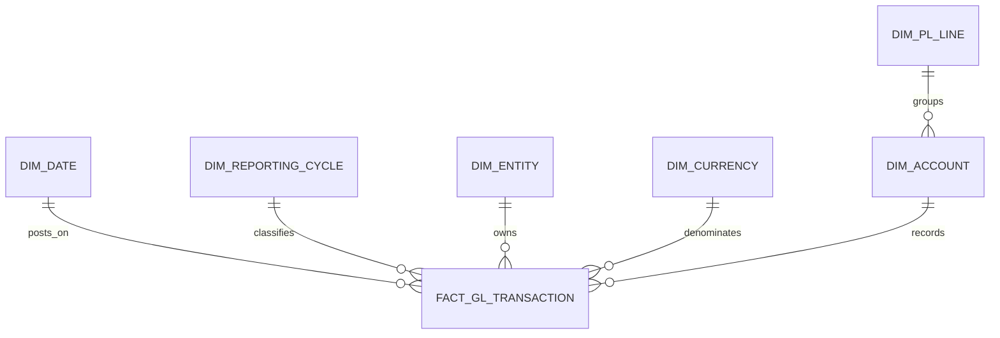
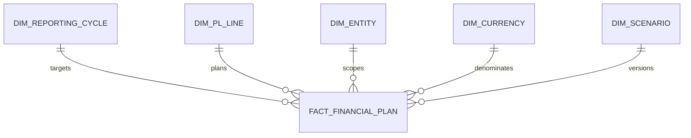
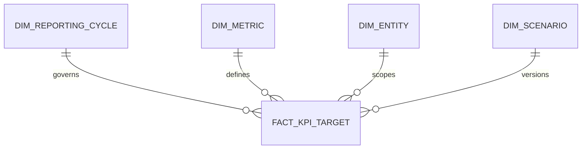
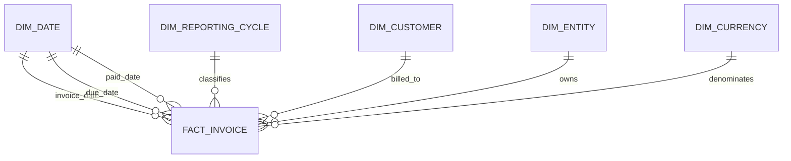
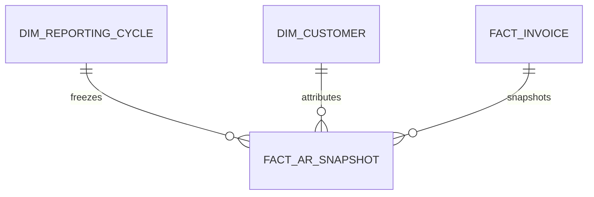
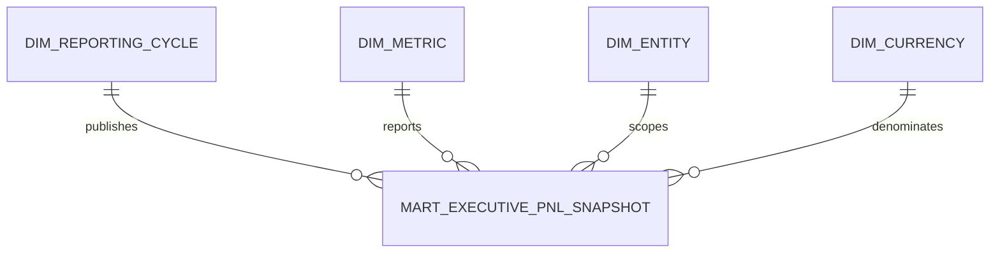
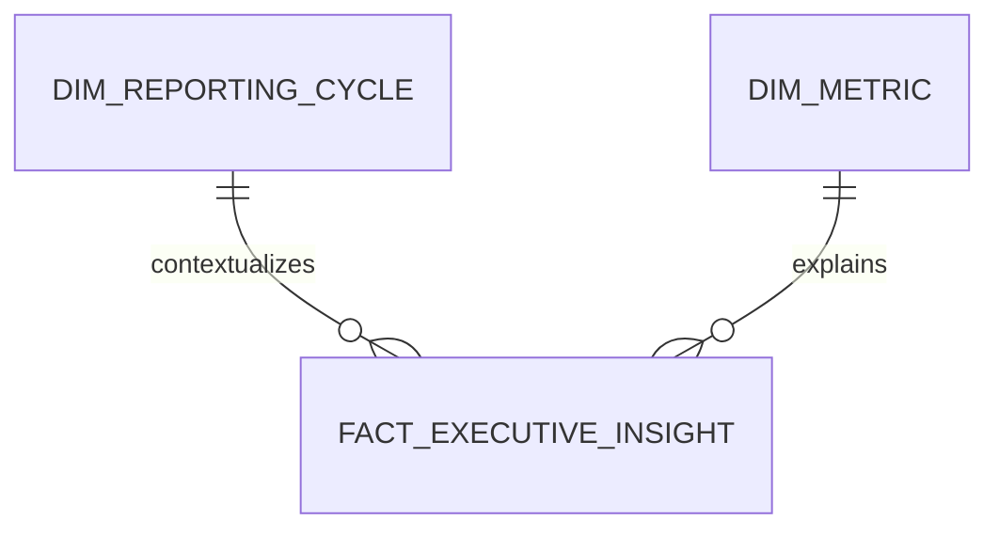

# Proposed P&L Dashboard Data Model

## Modeling objective

The target model supports a certified quarterly executive P&L briefing, a budget-to-actual variance bridge, a finance detail drill path, and a collections attention indicator. It keeps transaction, invoice, target, and snapshot grains separate. Ratios such as gross and net margin are derived from additive numerators and denominators and must never be summed or averaged.

The supplied extracts are sufficient for a prototype covering 2020 Q2-Q4, but not for a production executive semantic layer. The model therefore distinguishes fields supported now from fields that must be sourced or governed.

## Source assessment

| Extract | Observed grain | Rows | Coverage | Key |
| --- | --- | ---: | --- | --- |
| `gl_transactions.csv` | One GL transaction posting | 333 | 2020 Q2-Q4 | `transaction_id` |
| `chart_of_accounts.csv` | One account | 12 | Current-state reference | `account_id` |
| `budget_targets.csv` | One target per fiscal quarter and P&L section | 80 | 2017 Q1-2020 Q4 | `fiscal_quarter`, `pl_section` |
| `kpi_targets.csv` | One target/threshold per fiscal quarter and metric | 32 | 2017 Q1-2020 Q4 | `fiscal_quarter`, `metric_name` |
| `invoices.csv` | One invoice with cumulative amount paid and current status | 102 | 2020 Q2-Q4 | `invoice_id` |
| `customers.csv` | One current customer record | 22 | Current-state reference | `customer_id` |

Observed key and relationship checks pass. Six invoices have a paid date earlier than the invoice date and must be quarantined for timing/aging measures.

## Mermaid ERD

## Star/galaxy schema view

The full ERD above is the traceability view. This section presents the same tables per Kimball convention — one star per fact table, plus a constellation of the dimensions they share — for whoever builds the warehouse or semantic layer from this model.

### Snowflake resolution: `dim_pl_line` vs. `dim_account`

`dim_pl_line` is kept as a separate dimension rather than flattened onto `dim_account`, because it is referenced directly by `fact_financial_plan` and `fact_kpi_target` at a grain (P&L section) coarser than any individual account. Flattening it into `dim_account` would force those two facts to join through accounts they don't otherwise need, or would require duplicating the P&L hierarchy as a second copy. In the `fact_gl_transaction` star below, `dim_pl_line` is drawn as an outrigger off `dim_account`, not as one of the fact's direct points.

### `fact_gl_transaction` star

### `fact_financial_plan` star

### `fact_kpi_target` star

### `fact_invoice` star

`dim_date` role-plays three times on this fact (invoice, due, and paid dates); each role is a separate relationship to the same conformed dimension, not three different tables.

### `fact_ar_snapshot` star

This is a snapshot fact that also references `fact_invoice` directly (a fact-to-fact reference on the invoice's degenerate key), which is a standard Kimball pattern for periodic snapshots of a transaction fact — not a dimension relationship.

### `mart_executive_pnl_snapshot` star

### `fact_executive_insight` star

### Galaxy: conformed dimensions across facts

| Dimension | Referenced by |
| --- | --- |
| `dim_date` | `fact_gl_transaction`, `fact_invoice` (three roles: invoice/due/paid) |
| `dim_reporting_cycle` | All seven fact/mart tables — the dimension that makes every publication reproducible and versioned |
| `dim_entity` | `fact_gl_transaction`, `fact_financial_plan`, `fact_kpi_target`, `fact_invoice`, `mart_executive_pnl_snapshot` |
| `dim_currency` | `fact_gl_transaction`, `fact_financial_plan`, `fact_invoice`, `mart_executive_pnl_snapshot` |
| `dim_customer` | `fact_invoice`, `fact_ar_snapshot` |
| `dim_metric` | `fact_kpi_target`, `mart_executive_pnl_snapshot`, `fact_executive_insight` |
| `dim_scenario` | `fact_financial_plan`, `fact_kpi_target` |
| `dim_account` (+ outrigger `dim_pl_line`) | `fact_gl_transaction` directly; `dim_pl_line` also referenced directly by `fact_financial_plan` and `fact_kpi_target` |

## Dimension specifications

### `dim_date`

**Grain:** One row per calendar date.

| Column | Type | Nullable | Description |
| --- | --- | --- | --- |
| `date_key` | INTEGER | No | Primary key in `YYYYMMDD` form |
| `calendar_date` | DATE | No | Calendar date |
| `day_name` | VARCHAR | No | Day label |
| `month_number` | SMALLINT | No | Calendar month 1-12 |
| `month_name` | VARCHAR | No | Calendar month label |
| `calendar_quarter` | SMALLINT | No | Calendar quarter 1-4 |
| `calendar_year` | SMALLINT | No | Calendar year |
| `fiscal_month` | SMALLINT | No | Governed fiscal month |
| `fiscal_quarter` | VARCHAR | No | Governed fiscal quarter label |
| `fiscal_year` | SMALLINT | No | Governed fiscal year |
| `is_period_end` | BOOLEAN | No | Period-end marker |
| `is_business_day` | BOOLEAN | No | Business calendar marker |

**Keys:** PK `date_key`; alternate key `calendar_date`.

### `dim_reporting_cycle`

**Grain:** One governed reporting cycle and published version.

| Column | Type | Nullable | Description |
| --- | --- | --- | --- |
| `reporting_cycle_key` | BIGINT | No | Surrogate primary key |
| `cycle_code` | VARCHAR | No | Business identifier such as `2020-Q4-CLOSE` |
| `fiscal_quarter` | VARCHAR | No | Fiscal quarter |
| `period_start_date` | DATE | No | Included period start |
| `period_end_date` | DATE | No | Included period end |
| `snapshot_version` | INTEGER | No | Reproducible publication version |
| `cycle_status` | VARCHAR | No | Draft, reconciled, certified, or superseded |
| `certified_at` | TIMESTAMP | Yes | Certification timestamp |
| `certified_by` | VARCHAR | Yes | Certifying role or identity |
| `source_cutoff_at` | TIMESTAMP | No | Data cutoff used by the cycle |
| `published_at` | TIMESTAMP | Yes | Executive publication timestamp |

**Keys:** PK `reporting_cycle_key`; unique `cycle_code`, `snapshot_version`.

### `dim_pl_line`

**Grain:** One governed P&L presentation line or subtotal.

| Column | Type | Nullable | Description |
| --- | --- | --- | --- |
| `pl_line_key` | INTEGER | No | Surrogate primary key |
| `pl_line_code` | VARCHAR | No | Stable business code |
| `pl_line_name` | VARCHAR | No | Display name |
| `parent_pl_line_key` | INTEGER | Yes | Self-reference for hierarchy |
| `statement_order` | SMALLINT | No | Presentation order |
| `line_type` | VARCHAR | No | Detail, subtotal, or calculated ratio |
| `normal_sign` | SMALLINT | No | `1` revenue/income, `-1` expense |
| `favorable_direction` | VARCHAR | No | Higher or lower |
| `formula_code` | VARCHAR | Yes | Governed subtotal/ratio expression identifier |
| `is_leaf` | BOOLEAN | No | Whether transactions may map directly |
| `effective_from` | DATE | No | Definition validity start |
| `effective_to` | DATE | Yes | Definition validity end |

**Keys:** PK `pl_line_key`; unique `pl_line_code`, `effective_from`; FK `parent_pl_line_key` to this table.

### `dim_account`

**Grain:** One version of a GL account; SCD Type 2 when classification changes.

| Column | Type | Nullable | Description |
| --- | --- | --- | --- |
| `account_key` | BIGINT | No | Surrogate primary key |
| `account_id` | VARCHAR | No | Source natural key |
| `account_name` | VARCHAR | No | Account label |
| `pl_line_key` | INTEGER | No | Governed P&L line |
| `cost_category` | VARCHAR | Yes | Marketing, Shipping, Transactions, Other, or governed extension |
| `normal_sign` | SMALLINT | No | Source-to-report sign multiplier |
| `effective_from` | DATE | No | Version start |
| `effective_to` | DATE | Yes | Version end |
| `is_current` | BOOLEAN | No | Current-version flag |

**Keys:** PK `account_key`; unique `account_id`, `effective_from`; FK `pl_line_key`.

### `dim_customer`

**Grain:** One version of a customer; SCD Type 2 for segment changes.

| Column | Type | Nullable | Description |
| --- | --- | --- | --- |
| `customer_key` | BIGINT | No | Surrogate primary key |
| `customer_id` | VARCHAR | No | Source natural key |
| `customer_name` | VARCHAR | No | Display name |
| `segment` | VARCHAR | No | Online, Retail, Wholesale, or governed extension |
| `signup_date` | DATE | No | Customer start date |
| `effective_from` | DATE | No | Version start |
| `effective_to` | DATE | Yes | Version end |
| `is_current` | BOOLEAN | No | Current-version flag |

**Keys:** PK `customer_key`; unique `customer_id`, `effective_from`.

### `dim_metric`

**Grain:** One governed metric definition.

| Column | Type | Nullable | Description |
| --- | --- | --- | --- |
| `metric_key` | INTEGER | No | Surrogate primary key |
| `metric_code` | VARCHAR | No | Stable code such as `NET_INCOME` |
| `metric_name` | VARCHAR | No | Display name |
| `unit` | VARCHAR | No | USD, USD thousands, percent, or percentage points |
| `aggregation_type` | VARCHAR | No | Additive, semi-additive, or non-additive |
| `favorable_direction` | VARCHAR | No | Higher, lower, or band |
| `definition` | VARCHAR | No | Governed calculation definition |
| `executive_owner` | VARCHAR | Yes | Accountable role |
| `materiality_threshold` | DECIMAL(18,4) | Yes | Threshold for executive prominence |
| `effective_from` | DATE | No | Definition start |
| `effective_to` | DATE | Yes | Definition end |

**Keys:** PK `metric_key`; unique `metric_code`, `effective_from`.

### `dim_scenario`

**Grain:** One governed scenario/version family.

| Column | Type | Nullable | Description |
| --- | --- | --- | --- |
| `scenario_key` | INTEGER | No | Primary key |
| `scenario_code` | VARCHAR | No | Actual, Budget, Forecast, Stress, or other governed code |
| `scenario_name` | VARCHAR | No | Display label |
| `scenario_type` | VARCHAR | No | Actual, plan, forecast, or scenario |
| `approved_at` | TIMESTAMP | Yes | Approval timestamp |
| `approved_by` | VARCHAR | Yes | Approving authority |
| `version` | VARCHAR | No | Immutable version identifier |

**Keys:** PK `scenario_key`; unique `scenario_code`, `version`.

### `dim_entity`

**Grain:** One legal or management-reporting entity.

| Column | Type | Nullable | Description |
| --- | --- | --- | --- |
| `entity_key` | INTEGER | No | Primary key |
| `entity_code` | VARCHAR | No | Stable entity code |
| `entity_name` | VARCHAR | No | Display name |
| `parent_entity_key` | INTEGER | Yes | Consolidation hierarchy parent |
| `consolidation_currency_key` | INTEGER | No | Reporting currency |
| `effective_from` | DATE | No | Hierarchy validity start |
| `effective_to` | DATE | Yes | Hierarchy validity end |

**Keys:** PK `entity_key`; unique `entity_code`, `effective_from`; self-FK `parent_entity_key`.

### `dim_currency`

**Grain:** One ISO currency.

| Column | Type | Nullable | Description |
| --- | --- | --- | --- |
| `currency_key` | INTEGER | No | Primary key |
| `currency_code` | CHAR(3) | No | ISO 4217 code |
| `currency_name` | VARCHAR | No | Currency name |
| `minor_unit` | SMALLINT | No | Decimal precision |

**Keys:** PK `currency_key`; unique `currency_code`.

## Fact and mart specifications

### `fact_gl_transaction`

**Grain:** One posted GL transaction.

| Column | Type | Nullable | Measure behavior / description |
| --- | --- | --- | --- |
| `transaction_id` | VARCHAR | No | Degenerate primary key |
| `transaction_date_key` | INTEGER | No | FK to posting date |
| `reporting_cycle_key` | BIGINT | No | FK to governed cycle |
| `account_key` | BIGINT | No | FK to account version effective on posting date |
| `entity_key` | INTEGER | No | FK to reporting entity |
| `currency_key` | INTEGER | No | FK to transaction currency |
| `raw_amount` | DECIMAL(18,2) | No | Additive; source amount |
| `signed_amount` | DECIMAL(18,2) | No | Additive; `raw_amount × normal_sign` |
| `description` | VARCHAR | Yes | Source transaction narrative |
| `source_system` | VARCHAR | No | Lineage identifier |
| `source_loaded_at` | TIMESTAMP | No | Ingestion timestamp |

**Keys:** PK `transaction_id`; FKs as listed. Gross profit and net income are derived by summing `signed_amount` over governed P&L lines. Margin percentages are non-additive query measures.

### `fact_financial_plan`

**Grain:** One approved scenario value per reporting cycle, P&L line, entity, currency, and scenario version.

| Column | Type | Nullable | Measure behavior / description |
| --- | --- | --- | --- |
| `financial_plan_key` | BIGINT | No | Primary key |
| `reporting_cycle_key` | BIGINT | No | FK to cycle |
| `pl_line_key` | INTEGER | No | FK to target P&L line |
| `entity_key` | INTEGER | No | FK to entity |
| `currency_key` | INTEGER | No | FK to reporting currency |
| `scenario_key` | INTEGER | No | FK to Budget/Forecast scenario |
| `target_amount` | DECIMAL(18,2) | No | Additive only at its declared line/cycle grain |
| `signed_target_amount` | DECIMAL(18,2) | No | Additive contribution using line directionality |
| `source_loaded_at` | TIMESTAMP | No | Ingestion timestamp |

**Keys:** PK `financial_plan_key`; unique cycle, line, entity, currency, scenario. Actuals must roll up to this quarterly grain before comparison.

### `fact_kpi_target`

**Grain:** One governed target or threshold per reporting cycle, metric, entity, and scenario version.

| Column | Type | Nullable | Measure behavior / description |
| --- | --- | --- | --- |
| `kpi_target_key` | BIGINT | No | Primary key |
| `reporting_cycle_key` | BIGINT | No | FK to cycle |
| `metric_key` | INTEGER | No | FK to metric definition |
| `entity_key` | INTEGER | No | FK to entity |
| `scenario_key` | INTEGER | No | FK to approved target version |
| `target_value` | DECIMAL(18,4) | No | Non-additive target/threshold |
| `comparison_operator` | VARCHAR | No | `>=`, `<=`, or band |
| `effective_from` | DATE | No | Threshold validity start |
| `effective_to` | DATE | Yes | Threshold validity end |

**Keys:** PK `kpi_target_key`; unique cycle, metric, entity, scenario.

### `fact_invoice`

**Grain:** One issued invoice.

| Column | Type | Nullable | Measure behavior / description |
| --- | --- | --- | --- |
| `invoice_id` | VARCHAR | No | Degenerate primary key |
| `customer_key` | BIGINT | No | FK to customer version at invoice date |
| `entity_key` | INTEGER | No | FK to issuing entity |
| `currency_key` | INTEGER | No | FK to invoice currency |
| `reporting_cycle_key` | BIGINT | No | FK to issue-period cycle |
| `invoice_date_key` | INTEGER | No | FK to invoice date |
| `due_date_key` | INTEGER | No | Role-playing FK to date |
| `paid_date_key` | INTEGER | Yes | Role-playing FK; valid only after quality checks |
| `invoice_amount` | DECIMAL(18,2) | No | Additive |
| `amount_paid_current` | DECIMAL(18,2) | No | Semi-additive current source state; not historically reproducible alone |
| `current_status` | VARCHAR | No | Paid, Partial, or Unpaid |
| `quality_status` | VARCHAR | No | Valid, quarantined, or corrected |
| `source_loaded_at` | TIMESTAMP | No | Ingestion timestamp |

**Keys:** PK `invoice_id`; FKs as listed. Production should add payment events rather than relying on cumulative current state.

### `fact_ar_snapshot`

**Grain:** One open invoice as of one certified reporting-cycle snapshot.

| Column | Type | Nullable | Measure behavior / description |
| --- | --- | --- | --- |
| `ar_snapshot_key` | BIGINT | No | Primary key |
| `reporting_cycle_key` | BIGINT | No | FK to snapshot cycle |
| `invoice_id` | VARCHAR | No | FK to invoice |
| `customer_key` | BIGINT | No | FK to customer as of snapshot |
| `outstanding_amount` | DECIMAL(18,2) | No | Additive across invoices/customers, not across snapshots |
| `invoice_amount` | DECIMAL(18,2) | No | Additive within one snapshot |
| `days_past_due` | INTEGER | Yes | Derived from governed as-of date; null when quarantined |
| `aging_bucket` | VARCHAR | Yes | Current, 1-30, 31-60, 61-90, 90+ |
| `exposure_status` | VARCHAR | No | Within threshold, attention, or breach |
| `quality_status` | VARCHAR | No | Valid, quarantined, or corrected |

**Keys:** PK `ar_snapshot_key`; unique reporting cycle and invoice. Outstanding percentage is non-additive: sum outstanding divided by sum invoice amount within one snapshot.

### `mart_executive_pnl_snapshot`

**Grain:** One metric, entity, currency, and certified reporting-cycle snapshot.

| Column | Type | Nullable | Measure behavior / description |
| --- | --- | --- | --- |
| `executive_snapshot_key` | BIGINT | No | Primary key |
| `reporting_cycle_key` | BIGINT | No | FK to reproducible cycle version |
| `metric_key` | INTEGER | No | FK to governed metric |
| `entity_key` | INTEGER | No | FK to scope |
| `currency_key` | INTEGER | Yes | Null for unitless metrics |
| `actual_value` | DECIMAL(18,4) | No | Additive or non-additive per metric definition |
| `plan_value` | DECIMAL(18,4) | Yes | Approved commitment |
| `prior_period_value` | DECIMAL(18,4) | Yes | Previous comparable actual |
| `variance_to_plan` | DECIMAL(18,4) | Yes | Actual minus plan |
| `variance_to_plan_pct` | DECIMAL(18,4) | Yes | Non-additive; null for zero plan |
| `variance_to_prior` | DECIMAL(18,4) | Yes | Actual minus prior |
| `status_code` | VARCHAR | No | Favorable, adverse, attention, neutral, or unavailable |
| `data_quality_status` | VARCHAR | No | Certified, qualified, or unavailable |
| `calculation_version` | VARCHAR | No | Immutable semantic-rule version |

**Keys:** PK `executive_snapshot_key`; unique cycle, metric, entity, currency. This mart is rebuilt for each cycle version and never overwrites prior certified publications.

### `fact_executive_insight`

**Grain:** One reviewed narrative insight per reporting cycle, metric, and insight version.

| Column | Type | Nullable | Description |
| --- | --- | --- | --- |
| `insight_key` | BIGINT | No | Primary key |
| `reporting_cycle_key` | BIGINT | No | FK to cycle/version |
| `metric_key` | INTEGER | Yes | FK when insight is metric-specific |
| `insight_type` | VARCHAR | No | Headline, driver, implication, attention, or caveat |
| `insight_text` | VARCHAR | No | Conclusion-led narrative |
| `evidence_reference` | VARCHAR | No | IDs/queries supporting the statement |
| `author_role` | VARCHAR | No | Commentary author |
| `review_status` | VARCHAR | No | Draft, reviewed, approved, or superseded |
| `reviewed_by` | VARCHAR | Yes | Reviewer identity/role |
| `reviewed_at` | TIMESTAMP | Yes | Review timestamp |
| `valid_from` | TIMESTAMP | No | Narrative validity start |
| `valid_to` | TIMESTAMP | Yes | Supersession timestamp |

**Keys:** PK `insight_key`; FKs to cycle and metric. This provides commentary provenance without implementing a decision approval workflow.

## Derived semantic measures

| Measure | Rule | Aggregation warning |
| --- | --- | --- |
| Revenue | Sum signed GL amount for Revenue lines | Additive |
| Gross profit | Revenue + COGS signed amount | Additive after line mapping |
| Net income | Sum all governed P&L signed amounts | Additive |
| Gross margin % | Gross profit / Revenue | Recompute after aggregation; never average |
| Net margin % | Net income / Revenue | Recompute after aggregation; never average |
| Variance to plan | Actual − signed plan | Compare only after actuals roll to plan grain |
| Favorable contribution | Variance interpreted by metric/line directionality | Do not infer from color or raw sign alone |
| Outstanding amount | Invoice amount − cumulative amount paid as of snapshot | Semi-additive across time |
| Outstanding % | Sum outstanding / sum invoice amount for governed cohort | Non-additive |
| Threshold headroom | Threshold − outstanding % | Non-additive; percentage points |
| Driver contribution % | Line favorable variance / total net-income favorable variance | Non-additive; disclose denominator and exclusions |

## Gaps versus current sources

### Critical for production

1. **Entity and currency:** No extract identifies legal entity, management scope, transaction currency, reporting currency, or FX conversion. Prototype values can only be labeled `scope unknown` and `currency assumed USD`.
2. **Fiscal calendar governance:** `fiscal_quarter` exists, but fiscal month, period boundaries, close calendar, and business-day rules do not.
3. **Certification and lineage:** No source system identifiers, extraction timestamps, reconciliation status, certified-by fields, or immutable snapshot versions are supplied.
4. **Actual history:** GL and invoices cover only 2020 Q2-Q4. At least comparable prior-year actuals are needed for year-over-year evidence and structural trend claims.
5. **Forecast/outlook:** No forecast, latest estimate, scenario, assumption, or confidence data exists. The dashboard must label outlook unavailable.
6. **Invoice event history:** Only cumulative `amount_paid` and one `paid_date` are provided. Payment events and as-of snapshots are required for reproducible aging and cash-conversion history.
7. **Invoice date quality:** Six records show payment before invoice date. They must be corrected or quarantined before aging/timeliness metrics are certified.

### Required for richer driver explanation

1. **Revenue attribution:** GL revenue has no customer, invoice, product, channel, geography, or business-unit key. Customer-level revenue causality cannot be claimed from the current extracts.
2. **Cost-driver structure:** Free-text transaction descriptions do not provide supplier, cost center, department, project, volume, or rate drivers.
3. **Account hierarchy governance:** Current `pl_section` and `cost_category` values need stable codes, hierarchy order, effective dates, subtotal formulas, and favorable directionality.
4. **Budget detail:** Budget is available only by quarter and P&L section, not by account, month, entity, or driver. Account-level budget variance is unavailable.
5. **Materiality policy:** No approved absolute/relative thresholds determine which P&L changes qualify for executive prominence.

### Required for executive insight governance

1. **Metric ownership:** No executive owner, data steward, definition version, or certification SLA is provided.
2. **Commentary provenance:** No commentary author, evidence reference, review state, or review timestamp exists.
3. **Governance cycle:** The target leadership forum, publication deadline, and prior-cycle snapshot are unspecified.
4. **Collections ownership and cohort:** The accountable role, as-of convention, inclusion rules, write-off treatment, and threshold operator are not documented.

## Prototype assumptions

- Amounts are treated as USD because the screenshots use `$`; this is not source-confirmed.
- Calendar quarter equals fiscal quarter because all supplied transaction and invoice dates reconcile to their quarter labels.
- Budget values are converted to signed presentation values using Revenue `+1` and expense sections `-1`.
- The 18% margin value is treated as a minimum target and 15% collections value as a maximum attention threshold; the operators require business confirmation.
- Current invoice status is accepted for exposure totals, but six anomalous records are excluded from timing/aging claims.
- The executive snapshot is quarterly because actual extracts and targets share quarterly grain, despite the requirement mentioning monthly views.

## Model acceptance checks

- Actual transactions never join directly to quarterly targets without period aggregation.
- Margin percentages are calculated from additive amounts at query grain.
- Account and customer attributes resolve as of the fact date.
- Every published metric points to a reporting cycle, semantic version, quality state, scope, and unit.
- Certified executive snapshots are immutable and reproducible.
- Collections exposure uses one governed as-of snapshot and excludes/quarantines invalid date records from aging.
- Detail drill paths preserve the selected cycle and reconcile to the executive headline.
