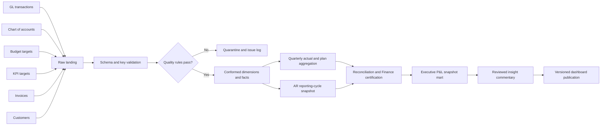

# P&L Dashboard Data Flow Specification

## Purpose

This specification maps the supplied extracts to the target dimensional model and the executive insight-driven publication. The process may ingest and validate source data daily, but the executive product is published on a governed quarterly-close cadence. Every published briefing must be reproducible from an immutable reporting-cycle version.

## End-to-end flow



## Cadence and service levels

| Layer | Proposed cadence | Completion rule |
| --- | --- | --- |
| Raw source landing | Daily when sources become operational; once per supplied extract for prototype | File checksum, source timestamp, row count, and immutable raw copy recorded |
| Conformed dimensions/facts | Daily after landing | Referential, duplicate-key, date, amount, and sign checks pass or rows are quarantined |
| AR snapshot | Daily operationally; frozen at quarter close for executive reporting | One record per invoice per governed as-of cycle |
| Financial close aggregation | At each quarter close and approved restatement | Actuals reconcile to the general ledger and plan version is approved |
| Executive snapshot mart | After Finance certification; rerun only as a new version | Metric, comparison, quality status, semantic version, and lineage are complete |
| Commentary review | After mart freeze, before briefing publication | Author, evidence references, reviewer, and status captured |
| Dashboard publication | Quarterly leadership cycle | Published version points to one certified cycle and cannot silently change |

The executive dashboard should display the reporting cycle, source cutoff, refresh time, certification state, and snapshot version. Daily refresh is not itself an executive requirement; reproducibility and alignment to the governance cycle are.

## Source-to-target mappings

### `chart_of_accounts.csv` to `dim_pl_line` and `dim_account`

| Source field | Target | Transformation |
| --- | --- | --- |
| `pl_section` | `dim_pl_line.pl_line_code/name` | Map source labels to governed stable codes; add statement order, parent hierarchy, line type, formula, and favorable direction |
| `account_id` | `dim_account.account_id` | Preserve natural key; generate surrogate key |
| `account_name` | `dim_account.account_name` | Trim and standardize |
| `cost_category` | `dim_account.cost_category` | Preserve null for Revenue and Tax unless governed categories are added |
| `normal_sign` | `dim_account.normal_sign` | Validate value is `1` or `-1`; compare with P&L-line direction |
| Not supplied | Effective dates and current flag | Add SCD Type 2 metadata from source change history or ingestion dates |

**Quality rules:** unique account ID; non-null account name and P&L section; normal sign restricted to `-1, 1`; every account maps to one active P&L line for a posting date.

### `gl_transactions.csv` to `fact_gl_transaction`

| Source field | Target | Transformation |
| --- | --- | --- |
| `transaction_id` | `transaction_id` | Preserve; reject duplicate keys |
| `transaction_date` | `transaction_date_key` | Parse ISO date and resolve `dim_date` |
| `fiscal_quarter` | `reporting_cycle_key` | Recompute quarter from governed fiscal calendar; compare with source label; resolve current cycle version |
| `account_id` | `account_key` | Effective-date lookup to `dim_account` |
| `amount` | `raw_amount` | Parse decimal; preserve source precision |
| `amount`, account `normal_sign` | `signed_amount` | Multiply amount by sign from the effective account record |
| `description` | `description` | Preserve as narrative only; do not derive causal categories without governed mapping |
| Not supplied | Entity, currency, source lineage | Populate from source-system metadata; prototype uses explicit unknown/assumed members |

**Quality rules:** unique transaction ID; valid date/quarter alignment; mapped account; finite amount; entity/currency present before certification. Reconcile signed period totals to the authoritative GL control total.

### `budget_targets.csv` to `fact_financial_plan`

| Source field | Target | Transformation |
| --- | --- | --- |
| `fiscal_quarter` | `reporting_cycle_key` | Resolve governed quarter and approved budget snapshot |
| `pl_section` | `pl_line_key` | Map to governed P&L line |
| `target_amount` | `target_amount` | Parse decimal |
| `target_amount`, line `normal_sign` | `signed_target_amount` | Apply Revenue `+1`, expense `-1`, from governed line metadata |
| Not supplied | `scenario_key` | Assign approved Budget version; do not use an unversioned default in production |
| Not supplied | Entity and currency | Populate from source scope metadata; reject ambiguity before certification |

**Quality rules:** unique cycle/line/entity/currency/scenario; non-negative source target unless policy permits otherwise; approved scenario version; complete required P&L sections.

### `kpi_targets.csv` to `dim_metric` and `fact_kpi_target`

| Source field | Target | Transformation |
| --- | --- | --- |
| `metric_name` | `dim_metric.metric_code` | Map `target_net_margin_pct` to `NET_MARGIN_PCT` and `collections_risk_threshold_pct` to `OUTSTANDING_INVOICE_PCT` |
| `fiscal_quarter` | `reporting_cycle_key` | Resolve governed reporting cycle |
| `target_value` | `fact_kpi_target.target_value` | Parse decimal percent |
| Not supplied | `comparison_operator` | Proposed `>=` for net margin and `<=` for collections; require owner confirmation |
| Not supplied | Definition, owner, materiality | Source through semantic governance process |

**Quality rules:** unique cycle/metric/entity/scenario; percentages in expected range; effective dates do not overlap; operator and unit are explicit.

### `customers.csv` to `dim_customer`

| Source field | Target | Transformation |
| --- | --- | --- |
| `customer_id` | `customer_id` | Preserve natural key; generate surrogate key |
| `customer_name` | `customer_name` | Trim and standardize |
| `segment` | `segment` | Validate against governed segment domain |
| `signup_date` | `signup_date` | Parse ISO date |
| Not supplied | Effective dates/current flag | Add SCD Type 2 metadata; production source must provide change capture or history |

**Quality rules:** unique customer ID; non-null name/segment; valid signup date; one effective customer version per invoice date.

### `invoices.csv` to `fact_invoice`

| Source field | Target | Transformation |
| --- | --- | --- |
| `invoice_id` | `invoice_id` | Preserve; reject duplicate key |
| `customer_id` | `customer_key` | Effective-date lookup to `dim_customer` |
| `invoice_date` | `invoice_date_key` | Parse and resolve date |
| `due_date` | `due_date_key` | Parse and resolve date; must not precede invoice date |
| `fiscal_quarter` | `reporting_cycle_key` | Recompute from governed calendar and compare with source |
| `invoice_amount` | `invoice_amount` | Parse decimal; require non-negative amount unless credit-note logic exists |
| `amount_paid` | `amount_paid_current` | Parse decimal; require `0 <= paid <= invoice` |
| `status` | `current_status` | Validate Paid/Partial/Unpaid against amounts |
| `paid_date` | `paid_date_key` | Parse when present; quarantine timing use when paid date precedes invoice date |
| Not supplied | Entity, currency, lineage | Populate from system metadata |

**Quality rules:** unique invoice ID; mapped customer; valid date sequence; amount/status consistency; paid date required for Paid after source policy is confirmed. The six supplied paid-before-invoice rows receive `quality_status = quarantined` for payment timing and aging; financial exposure amounts may remain usable if reconciled.

### `fact_invoice` to `fact_ar_snapshot`

For each governed as-of cycle:

1. Select invoices issued on or before the as-of date under the confirmed cohort rule.
2. Apply payment events through the as-of timestamp. The current extract lacks events, so historical snapshots cannot be backfilled reliably from cumulative current values.
3. Calculate `outstanding_amount = invoice_amount - paid_to_date`.
4. Calculate `days_past_due = max(0, as_of_date - due_date)` only for valid date records.
5. Assign aging bucket from governed boundaries.
6. Calculate portfolio outstanding percentage as `sum(outstanding) / sum(invoice_amount)` for the same cohort.
7. Compare with the cycle's approved collections threshold and label status.
8. Preserve one immutable snapshot row per invoice and reporting-cycle version.

### Core facts to `mart_executive_pnl_snapshot`

Build one metric row per certified cycle/entity/currency:

| Metric | Actual source | Plan/target source | Transformation |
| --- | --- | --- | --- |
| Revenue | Sum signed GL Revenue | Signed Revenue budget | Aggregate actuals to quarter before comparing |
| Gross profit | Revenue + signed COGS | Revenue plan + signed COGS plan | Store amount; compute gross margin separately |
| Operating expense | Sum signed Opex | Signed Opex budget | Apply lower-is-favorable semantics to display status |
| Net income | Sum all signed P&L lines | Sum all signed section budgets | Build bridge from line-level variance contributions |
| Net margin % | Net income / Revenue | `target_net_margin_pct` | Recompute ratio at cycle/entity grain |
| Outstanding invoice % | AR snapshot numerator/denominator | Collections threshold | Recompute ratio at snapshot grain; calculate threshold headroom |

For every metric, calculate absolute and relative variance, resolve favorable direction from `dim_metric`, attach quality and certification state, and write an immutable semantic-rule version.

### `mart_executive_pnl_snapshot` to `fact_executive_insight`

1. Generate an evidence packet containing the headline metric, plan variance, prior-period comparison, top driver contributions, collections proximity, and all caveats.
2. Draft conclusion-led text from governed metrics only.
3. Require Finance review of causal language and implications.
4. Store evidence references, author role, reviewer, review timestamp, and status.
5. Publish only reviewed commentary associated with the same reporting-cycle and calculation versions as the metrics.
6. Supersede commentary by creating a new version, never by overwriting a published record.

## Metric transformation rules

### Net-income variance bridge

At reporting-cycle grain:

```text
budget_net_income = sum(signed_target_amount)
line_variance = actual_signed_amount - signed_target_amount
actual_net_income = budget_net_income + sum(line_variance)
```

The 2020 Q4 prototype reconciles as:

| Step | Amount |
| --- | ---: |
| Budget net income | $22,878.07 |
| Revenue contribution | +$3,193.74 |
| COGS contribution | +$3,214.77 |
| Operating-expense contribution | +$1,498.39 |
| Other-expense contribution | +$70.64 |
| Tax contribution | +$58.42 |
| Actual net income | $30,914.03 |

Tolerance: ending actual must equal certified net income within `$0.01` after rounding policy is applied.

### Margin calculations

```text
gross_margin_pct = 100 * gross_profit / revenue
net_margin_pct = 100 * net_income / revenue
```

Return null and quality status `unavailable` when revenue is zero. Never average account, month, or entity margin percentages to produce a consolidated ratio.

### Collections exposure

```text
outstanding_amount = invoice_amount - paid_to_date_as_of_snapshot
outstanding_pct = 100 * sum(outstanding_amount) / sum(invoice_amount)
threshold_headroom_pp = threshold_pct - outstanding_pct
```

The cohort denominator, as-of timestamp, treatment of credit notes/write-offs, and late corrections require owner approval. The 2020 Q4 sample produces 14.70% versus a 15.00% proposed ceiling.

## Data quality controls

| Control | Severity | Handling |
| --- | --- | --- |
| Duplicate transaction or invoice natural key | Critical | Reject batch or duplicate rows; do not publish |
| Unmapped account/customer | Critical | Quarantine; fail affected metric certification |
| Fiscal label differs from governed calendar | Critical | Quarantine and investigate |
| Paid date before invoice date | High | Quarantine from aging/timeliness; expose qualified status |
| Invoice amount/status inconsistency | High | Quarantine invoice; fail exposure reconciliation if material |
| Missing entity/currency | Critical for production | Use explicit unknown only in prototype; block certification |
| Budget version unapproved | Critical | Do not compare actual to plan |
| Metric denominator zero | High | Return unavailable, not zero or infinity |
| Actual/GL control mismatch beyond tolerance | Critical | Block executive snapshot |
| Commentary references stale metric version | Critical | Invalidate commentary and republish review packet |
| Late source correction after publication | High | Create restated reporting-cycle version; retain prior version |

## Reconciliation checks

Before Finance certification:

- Raw-to-conformed row counts and rejected-row counts reconcile by source file.
- GL transaction amounts reconcile by account and cycle before/after sign application.
- P&L leaf accounts roll to each governed subtotal exactly once.
- Quarterly actual totals reconcile to the authoritative GL control total.
- Plan totals reconcile to the approved budget version.
- Variance bridge starts at budget net income and ends at actual net income within tolerance.
- Invoice amount equals paid plus outstanding for every included invoice.
- AR snapshot totals reconcile to receivables controls for the same as-of timestamp.
- Executive mart figures reproduce the metric packet used for commentary review.

## Publication contract

The dashboard query must pin these values for the entire user session:

- `reporting_cycle_key` and `snapshot_version`;
- `entity_key` and consolidation scope;
- reporting currency and FX version;
- scenario/budget version;
- metric-definition/calculation version;
- commentary version;
- data-quality and certification status.

Opening `Finance detail` passes the same context. A restatement appears as a new version and visibly labels what changed.

## Assumptions requiring confirmation

1. The audience is a senior leadership or finance committee receiving a quarterly close briefing.
2. Calendar and fiscal quarters are currently identical.
3. All supplied values are USD and represent one consolidated entity.
4. Budget is the approved primary comparison; Q3 is secondary context.
5. Net margin has a minimum target of 18%; collections exposure has a maximum threshold of 15%.
6. Invoice exposure belongs on the same executive P&L brief rather than a separate working-capital dashboard.
7. Paid-before-invoice records are source defects, not prepayments or migration artifacts.
8. The authoritative production systems can provide GL controls, invoice payment events, source timestamps, entity, and currency.

## Open engineering and governance questions

- What systems own GL actuals, budget, invoices, customer master, and metric targets?
- What is the fiscal calendar, close SLA, and late-adjustment policy?
- What are the legal-entity, consolidation, intercompany, currency, and FX rules?
- Which budget version is approved, and how are reforecasts versioned?
- How should account hierarchy changes restate or preserve historical reporting?
- What is the approved materiality rule for promoting a variance to the executive surface?
- What is the collections cohort and as-of convention, and do partial payments have event-level history?
- Who owns each metric, certifies the close, and reviews executive commentary?
- Where should certified snapshots and commentary review states be retained?
- What retention and access controls apply to customer-level receivables exposure?

## Delivery sequence

1. Stand up raw landing, source manifests, and quality issue logging.
2. Implement date, cycle, P&L-line, account, metric, customer, scenario, entity, and currency dimensions.
3. Load GL actual and plan facts; reconcile and certify the 2020 Q4 prototype.
4. Build the executive P&L snapshot and variance bridge.
5. Resolve invoice anomalies and source payment events; then build certified AR snapshots.
6. Add governed commentary provenance and the versioned publication contract.
7. Backfill comparable actual history and integrate forecast data before expanding trend/outlook content.
